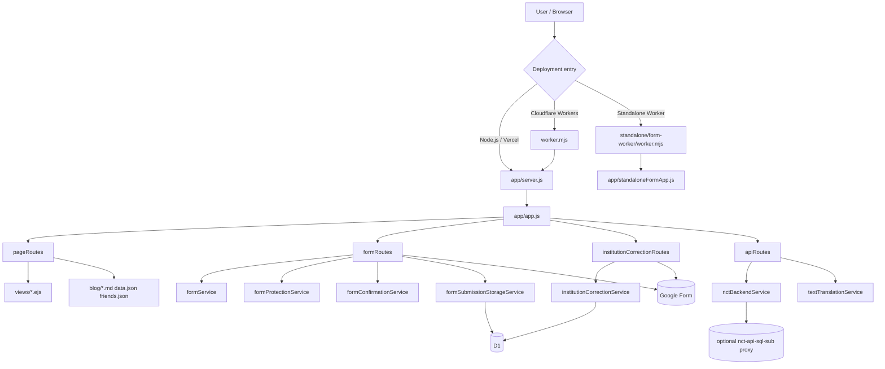

# N·C·T Legacy

<div align="center">
  <p><strong>NO CONVERSION THERAPY</strong></p>
  <p>The legacy <code>Express + EJS</code> site and form-flow repository for documenting, organizing, and publicly presenting information about conversion therapy institutions and lived experiences.</p>
  <p>
    <a href="./README.md">简体中文</a> ·
    <a href="./README.zh-TW.md">繁體中文</a> ·
    <a href="./README.en.md"><strong>English</strong></a>
  </p>
  <p>
    
    
    
    
    
  </p>
</div>

> The multilingual README files are kept aligned as closely as possible. If anything differs, trust the actual code, scripts, and configuration in this repository.

## Contents

- [Overview](#overview)
- [Current Role](#current-role)
- [Core Capabilities](#core-capabilities)
- [Tech Stack](#tech-stack)
- [Architecture Diagram](#architecture-diagram)
- [Repository Layout](#repository-layout)
- [Quick Start](#quick-start)
- [Common Commands](#common-commands)
- [Playwright Smoke Screenshots](#playwright-smoke-screenshots)
- [Key Configuration](#key-configuration)
- [Protecting Sensitive Configuration](#protecting-sensitive-configuration)
- [Form Privacy Notice](#form-privacy-notice)
- [Deployment Notes](#deployment-notes)
- [Route Overview](#route-overview)
- [Runtime API Status](#runtime-api-status)
- [Related Files](#related-files)
- [Contributing](#contributing)
- [License](#license)

## Overview

`NCT_old` is the legacy repository split out from the sibling `No-Torsion` project. It keeps the older `Express + EJS` site, the original form submission flow, the Cloudflare Workers entry, and the standalone form Worker.

It is still used for these scenarios:

- Maintaining the legacy homepage, map, blog, privacy page, and record detail pages
- Keeping the original `/form`, `/map/correction`, and `/correction` submission flows
- Writing submissions to Google Form, D1, or both, depending on configuration
- Proxying form, correction, and translation flows to `nct-api-sql-sub` while preserving the local legacy shell
- Deploying a standalone `standalone/form-worker` that serves only the questionnaire entry

## Current Role

Responsibilities in the current workspace are now split like this:

| Directory | Current responsibility |
| --- | --- |
| `NCT_old` | Legacy `Express + EJS + Workers` site and form flow |
| `No-Torsion` | New static `Vite + React` frontend shell |
| `nct-api-sql` | Main data service, public JSON, admin, and sync capabilities |
| `nct-api-sql-sub` | Standalone form page, No-Torsion-compatible backend APIs, translation, and reporting |

If you still need the older SSR pages or legacy submission flow, keep working in this repository. If you are maintaining the new frontend shell, move to the sibling `No-Torsion` project instead.

## Core Capabilities

| Module | Description |
| --- | --- |
| Legacy site | `Express 5 + EJS` renders the home page, map, blog, privacy page, detail pages, and more |
| Anonymous form | `/form` supports preview, confirmation, anti-abuse tokens, rate limiting, and Google Form / D1 delivery |
| Institution supplement / correction | `/map/correction` and `/correction` keep their own submission flow |
| Standalone form entry | `standalone/form-worker` can mount the questionnaire directly at `/` |
| Workers compatibility | `worker.mjs` reuses the same Express business logic and adds extra protection for `cn.json` |
| Backend proxy mode | Runtime token issuance, form confirmation, correction submission, and translation can be proxied to `nct-api-sql-sub` |
| Multilingual UI | i18n support for Simplified Chinese, Traditional Chinese, and English |
| Content site | Markdown blog posts plus `data.json` and `friends.json` remain part of the content source |

## Tech Stack

| Category | Choice |
| --- | --- |
| Backend | Node.js 20+, Express 5 |
| Template engine | EJS |
| Frontend | Legacy `public/js` plus `views/*.ejs` |
| Runtime targets | Node.js / Cloudflare Workers / Vercel-compatible Node entry |
| Data sinks | Google Form / Cloudflare D1 |
| Rate limiting | In-memory limiter with optional Redis shared storage |
| Translation | Google Cloud Translation API, with optional proxying to `nct-api-sql-sub` |
| Config security | `scripts/secure-config.js` for encrypted config values |

## Architecture Diagram



Notes:

- `worker.mjs` only adds entry-layer patches. Core business logic still lives in the Express layer.
- `standalone/form-worker` reuses the root source tree, but bundles only the pages and assets required by the standalone questionnaire.
- The old map aggregation API is retired. Both the main app and the standalone form now read `public/content/*.json` directly.

## Repository Layout

```text
.
├── app/
│   ├── middleware/              # i18n, maintenance mode, and Workers static-file adapters
│   ├── routes/                  # page, form, correction, and API routes
│   ├── services/                # form, map, translation, proxy, template cache, and more
│   ├── app.js                   # main-site Express assembly
│   ├── server.js                # Node entry
│   ├── standaloneFormApp.js     # standalone form Express assembly
│   └── standaloneFormServer.js  # standalone form Node entry
├── config/                      # runtime config, form rules, security, and i18n
├── public/                      # static assets, GeoJSON, content snapshots, scripts, and styles
├── views/                       # EJS templates
├── blog/                        # Markdown blog posts
├── migrations/                  # D1 migrations
├── scripts/                     # helpers such as secure-config
├── standalone/form-worker/      # standalone questionnaire Worker package
├── tests/                       # Node and Playwright tests
├── data.json                    # article index and other site data
├── friends.json                 # about-page links / acknowledgement data
├── server.js                    # Vercel-compatible entry
├── vercel.json                  # Vercel config
└── worker.mjs                   # main-site Cloudflare Workers entry
```

## Quick Start

### 1. Install dependencies

```bash
git clone https://github.com/medicagooo/NCT_old.git
cd NCT_old
npm install
```

### 2. Run the legacy site in Node mode

```bash
cp .env.example .env
npm start
```

Default behavior:

- `npm start` and `npm run dev` both force `FRONTEND_VARIANT=legacy`
- The default local address is `http://127.0.0.1:3000`
- During local development, keep `FORM_DRY_RUN="true"` unless you explicitly want live writes

### 3. Run the legacy site in Workers mode

```bash
cp .dev.vars.example .dev.vars
npm run dev:workers
```

### 4. Optional: verify the compatibility React shell

The repository still keeps `public/react-app/` build artifacts plus `react_app.ejs` for migration-period verification, but the root `npm` scripts are still aimed at the legacy frontend.

If you truly need to verify the React shell manually, run:

```bash
FRONTEND_VARIANT=react node app/server.js
```

Notes:

- This is not the recommended day-to-day maintenance entry
- The repository does not currently provide a root-level script to rebuild those React assets

## Common Commands

| Command | Description |
| --- | --- |
| `npm start` | Start the legacy site in Node mode, forcing `FRONTEND_VARIANT=legacy` |
| `npm run dev` | Same as `npm start` |
| `npm run dev:workers` | Run the main-site Workers entry locally |
| `npm run deploy:workers` | Deploy the main site to Cloudflare Workers |
| `npm test` | Run the main test suite |
| `npm run test:standalone` | Run only the standalone-form-related tests |
| `npm run test:smoke` | Run the Playwright smoke screenshot suite |
| `npm run dev:workers:standalone-form` | Run the standalone questionnaire Worker locally |
| `npm run deploy:workers:standalone-form` | Deploy the standalone questionnaire Worker |
| `npm run secure-config -- generate-secret` | Generate a strong `FORM_PROTECTION_SECRET` |
| `npm run secure-config -- bootstrap-env --env-file ".env"` | Replace plain `FORM_ID` / `GOOGLE_SCRIPT_URL` with encrypted values in an env file |

## Playwright Smoke Screenshots

This suite starts a local app instance and captures screenshots of key routes while checking for:

- page-level `console.error`
- uncaught exceptions
- failed same-origin requests
- form preview / confirmation / success flows continuing to work

Install the browser once before the first run:

```bash
npx playwright install chromium
```

Then run:

```bash
npm run test:smoke
```

Output location:

- `test-results/playwright-smoke/`
- `manifest.json` records each route, screenshot path, and HTTP status

## Key Configuration

For the full variable reference, read [`.env.example`](./.env.example) and [`.dev.vars.example`](./.dev.vars.example). This section only highlights the most commonly touched values.

| Variable | Purpose |
| --- | --- |
| `SITE_URL` | Canonical site URL used for `robots.txt`, `sitemap.xml`, and canonical links |
| `FRONTEND_VARIANT` | `legacy` or `react`; the root `npm` scripts still force `legacy` |
| `FORM_DRY_RUN` | When `true`, submissions are previewed instead of actually sent |
| `FORM_SUBMIT_TARGET` | `/form` delivery target: `google`, `d1`, or `both` |
| `CORRECTION_SUBMIT_TARGET` | `/map/correction` and `/correction` delivery target: `google`, `d1`, or `both` |
| `FORM_PROTECTION_SECRET` | Core secret for form-protection tokens and encrypted-config decryption |
| `FORM_ID` / `FORM_ID_ENCRYPTED` | Google Form ID for the anonymous form, choose one |
| `CORRECTION_FORM_ID` / `CORRECTION_GOOGLE_FORM_URL` | Google Form config for institution correction |
| `GOOGLE_SCRIPT_URL` / `GOOGLE_SCRIPT_URL_ENCRYPTED` | Private Apps Script data source, choose one |
| `PUBLIC_MAP_DATA_URL` | Public map JSON URL; normalized to `/content/map-data.json` by default |
| `GOOGLE_CLOUD_TRANSLATION_API_KEY` | Required when local translation is enabled |
| `NCT_BACKEND_SERVICE_URL` | When set, runtime token, form confirmation, correction, and translation flows proxy to `nct-api-sql-sub` |
| `NCT_BACKEND_SERVICE_TOKEN` | Bearer token for that backend proxy |
| `RATE_LIMIT_REDIS_URL` | Shared rate-limit storage for multi-instance deployments |
| `D1_BINDING_NAME` | Only needed when the D1 binding name is not `NCT_DB` / `DB` |
| `MAP_DATA_NODE_TRANSPORT_OVERRIDES` | Enables proxy / IPv4 transport overrides in Node runtime only |

Configuration rules:

- Choose only one of `FORM_ID` and `FORM_ID_ENCRYPTED`.
- Choose only one of `GOOGLE_SCRIPT_URL` and `GOOGLE_SCRIPT_URL_ENCRYPTED`.
- If `FORM_SUBMIT_TARGET` includes `google`, the app must be able to resolve a `FORM_ID`.
- If `CORRECTION_SUBMIT_TARGET` includes `google`, you need `CORRECTION_FORM_ID` or `CORRECTION_GOOGLE_FORM_URL`.
- If any submission target includes `d1`, make sure D1 is actually bound in Workers or on the target platform.
- If `NCT_BACKEND_SERVICE_URL` is configured, some runtime flows are forwarded to `nct-api-sql-sub` instead of using the local legacy implementation.

## Protecting Sensitive Configuration

If you do not want `FORM_ID` and `GOOGLE_SCRIPT_URL` stored in plaintext env files, use the built-in helper to convert them into encrypted values.

Convert an existing env file in place:

```bash
npm run secure-config -- bootstrap-env --env-file ".env"
```

For local Workers development:

```bash
npm run secure-config -- bootstrap-env --env-file ".dev.vars"
```

You can also do it step by step:

```bash
npm run secure-config -- generate-secret
```

```bash
npm run secure-config -- encrypt --purpose form-id --secret "YOUR_FORM_PROTECTION_SECRET" --value "YOUR_GOOGLE_FORM_ID"
npm run secure-config -- encrypt --purpose google-script-url --secret "YOUR_FORM_PROTECTION_SECRET" --value "YOUR_GOOGLE_SCRIPT_URL"
```

Important boundaries:

- If you use `FORM_ID_ENCRYPTED` or `GOOGLE_SCRIPT_URL_ENCRYPTED`, you must still explicitly set `FORM_PROTECTION_SECRET`.
- This reduces accidental plaintext exposure, but it does not replace real backend trust boundaries.

## Form Privacy Notice

The current boundary for the form flow should remain:

> Basic personal information such as birth year and sex should be kept strictly confidential. Public-facing fields such as institution exposure details and experience summaries may appear on the site. Do not enter highly sensitive personal data such as government ID numbers, private phone numbers, or home addresses into fields that may become public.

If you later change which fields are public, make sure to update all of these together:

- the form-page notice copy
- `/privacy`
- this README

## Deployment Notes

### Main Cloudflare Workers site

Validate locally first:

```bash
cp .dev.vars.example .dev.vars
npm run dev:workers
npm test
```

Deploy:

```bash
npm run deploy:workers
```

Notes:

- The main-site Workers config lives in [`wrangler.jsonc`](./wrangler.jsonc)
- The repository keeps a minimal `NCT_DB` D1 binding; account-specific settings should go into the Cloudflare Dashboard
- Put sensitive values in `Variables and Secrets` whenever possible

### Standalone questionnaire Worker

If you only want to deploy the questionnaire entry, use:

```bash
npm run dev:workers:standalone-form
npm run deploy:workers:standalone-form
```

See [standalone/form-worker/README.md](./standalone/form-worker/README.md) for the Worker-specific notes.

### Node / Vercel-compatible entry

The repository still keeps:

- [`server.js`](./server.js)
- [`vercel.json`](./vercel.json)

That lets you run the app as a Node-compatible service or attach it to Vercel's Node function mode.

## Route Overview

### Page routes

| Path | Description |
| --- | --- |
| `/` | Legacy home page |
| `/form` | Main anonymous form page |
| `/form/standalone` | Standalone questionnaire page inside the main app |
| `/map/correction` / `/correction` | Institution supplement / correction page |
| `/map` | Map overview page |
| `/map/record/:recordSlug` | Single-record detail page |
| `/aboutus` | About page |
| `/privacy` | Privacy notice page |
| `/blog` | Blog index |
| `/port/:id` | Blog article detail |
| `/debug` | Debug page, available only when `DEBUG_MOD=true` |
| `/robots.txt` | Generated robots file |
| `/sitemap.xml` | Generated sitemap |

### Submission flow routes

| Path | Description |
| --- | --- |
| `POST /submit` | Main form entry; renders preview or confirmation depending on config |
| `POST /submit/confirm` | Final main-form delivery; writes to Google Form, D1, or proxies to `nct-api-sql-sub` |
| `POST /map/correction/submit` | Institution correction submit entry |
| `POST /correction/submit` | Same as above, kept as a compatibility alias |

### Standalone questionnaire Worker routes

| Path | Description |
| --- | --- |
| `/` | Standalone questionnaire home |
| `/form/standalone` | Compatibility alias for `/` |
| `/submit` | Standalone questionnaire submit entry |
| `/submit/confirm` | Standalone questionnaire confirmation submit entry |
| `/debug` | Standalone questionnaire debug page |
| `/healthz` | Health check |

## Runtime API Status

### APIs still in use

| Path | Description |
| --- | --- |
| `GET /api/frontend-runtime?scope=form|correction` | Issues form-protection tokens; proxies to `nct-api-sql-sub` when `NCT_BACKEND_SERVICE_URL` is configured |
| `POST /api/translate-text` | Translates small batches of detail text; can run locally or proxy to `nct-api-sql-sub` |
| `GET /cn.json` | China GeoJSON with extra integrity handling in Workers |

### Retired APIs

These endpoints now return `410 Gone` in both the main app and the standalone questionnaire:

| Path | Status | Replacement |
| --- | --- | --- |
| `GET /api/map-data` | Retired | Read `public/content/map-data.json` directly, or use your configured `PUBLIC_MAP_DATA_URL` |
| `GET /api/area-options` | Retired | Read `public/content/area-selector.json` directly |

In other words, the current map pages and standalone form no longer depend on server-side aggregation APIs. They consume static or public JSON directly.

## Related Files

- [`.env.example`](./.env.example): Node-mode environment template
- [`.dev.vars.example`](./.dev.vars.example): Workers local-development env template
- [`wrangler.jsonc`](./wrangler.jsonc): main-site Workers config
- [`standalone/form-worker/wrangler.jsonc`](./standalone/form-worker/wrangler.jsonc): standalone questionnaire Worker config
- [`scripts/secure-config.js`](./scripts/secure-config.js): encrypted-config helper
- [`worker.mjs`](./worker.mjs): main-site Workers entry
- [`app/app.js`](./app/app.js): main-site Express assembly
- [`app/standaloneFormApp.js`](./app/standaloneFormApp.js): standalone questionnaire Express assembly
- [`migrations/`](./migrations): D1 schema migrations

## Contributing

Before submitting changes, at minimum run:

```bash
npm test
```

If your changes touch templates, pages, or the form flow, it is also worth running:

```bash
npm run test:smoke
```

## License

See [LICENSE](./LICENSE) for the project license.
