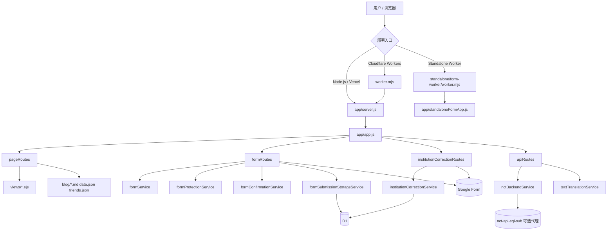

# N·C·T Legacy

<div align="center">
  <p><strong>NO CONVERSION THERAPY</strong></p>
  <p>旧版 <code>Express + EJS</code> 主站与表单链路仓库，用于记录、整理与公开展示“扭转治疗”相关机构与经历信息。</p>
  <p>
    <a href="./README.md"><strong>简体中文</strong></a> ·
    <a href="./README.zh-TW.md">繁體中文</a> ·
    <a href="./README.en.md">English</a>
  </p>
  <p>
    
    
    
    
    
  </p>
</div>

> 多语言版本已尽量保持同步；如有差异，请以当前仓库中的实际代码、脚本与配置为准。

## 目录

- [项目简介](#项目简介)
- [当前定位](#当前定位)
- [核心能力](#核心能力)
- [技术栈](#技术栈)
- [技术架构图](#技术架构图)
- [仓库结构](#仓库结构)
- [快速开始](#快速开始)
- [常用命令](#常用命令)
- [Playwright 页面冒烟截图巡检](#playwright-页面冒烟截图巡检)
- [关键配置](#关键配置)
- [保护敏感配置](#保护敏感配置)
- [表单隐私说明](#表单隐私说明)
- [部署说明](#部署说明)
- [路由总览](#路由总览)
- [运行时接口现状](#运行时接口现状)
- [相关文件](#相关文件)
- [贡献](#贡献)
- [授权](#授权)

## 项目简介

`NCT_old` 是从同级 `No-Torsion` 拆出的 legacy 仓库，保留了旧版 `Express + EJS` 主站、表单提交流程、Cloudflare Workers 入口，以及独立表单 Worker。

它仍然服务这些场景：

- 维护旧版主页、地图、博客、隐私页与机构详情页
- 继续使用原有 `/form`、`/map/correction`、`/correction` 提交流程
- 按配置把提交写入 Google Form、D1，或同时写入两者
- 在保留本地旧逻辑的同时，把表单、修正、翻译代理到 `nct-api-sql-sub`
- 单独部署一个只承载问卷入口的 `standalone/form-worker`

## 当前定位

当前工作区里的几个项目职责已经拆分：

| 目录 | 当前职责 |
| --- | --- |
| `NCT_old` | 旧版 `Express + EJS + Workers` 主站与表单链路 |
| `No-Torsion` | 新的静态 `Vite + React` 前端壳层 |
| `nct-api-sql` | 主数据服务、公开 JSON、管理与同步能力 |
| `nct-api-sql-sub` | 独立表单页、No-Torsion 兼容后端 API、翻译与上报 |

如果你还需要旧版 SSR 页面或旧提交流程，请继续维护本仓库；如果你要维护新前端壳层，请转到同级 `No-Torsion`。

## 核心能力

| 模块 | 说明 |
| --- | --- |
| 旧版主站 | `Express 5 + EJS` 渲染首页、地图、博客、隐私页、详情页等 |
| 匿名表单 | `/form` 支持预览、确认、防刷 token、限流与 Google Form/D1 投递 |
| 机构补充 / 修正 | `/map/correction` 与 `/correction` 支持独立提交流程 |
| 独立表单入口 | `standalone/form-worker` 可把问卷单页直接挂到 `/` |
| Workers 兼容 | `worker.mjs` 复用同一套 Express 业务逻辑，并额外保护 `cn.json` 响应 |
| 后端代理模式 | 可选把前端 runtime、表单确认、机构修正、翻译代理到 `nct-api-sql-sub` |
| 多语言 | 通过 i18n 支持简中、繁中、英文 |
| 内容站点 | 博客 Markdown、`data.json`、`friends.json` 继续作为站点内容源 |

## 技术栈

| 类别 | 选型 |
| --- | --- |
| 服务端 | Node.js 20+, Express 5 |
| 模板引擎 | EJS |
| 前端 | 旧版 `public/js` + `views/*.ejs` |
| 运行时 | Node.js / Cloudflare Workers / Vercel Node 兼容入口 |
| 数据写入 | Google Form / Cloudflare D1 |
| 限流 | 内存限流，可选 Redis 共享限流 |
| 翻译 | Google Cloud Translation API，可选代理到 `nct-api-sql-sub` |
| 配置安全 | `scripts/secure-config.js` 生成密文配置 |

## 技术架构图



补充说明：

- `worker.mjs` 只做入口级补丁，核心业务仍然跑在 Express 层。
- `standalone/form-worker` 会复用根目录源码，但只暴露独立问卷所需页面与资源。
- 地图聚合接口已经退役，当前主应用与独立表单都改为直接读取 `public/content/*.json`。

## 仓库结构

```text
.
├── app/
│   ├── middleware/              # i18n、维护模式、Workers 静态资源适配
│   ├── routes/                  # 页面、表单、修正、API 路由
│   ├── services/                # 表单、地图、翻译、代理、模板缓存等核心服务
│   ├── app.js                   # 主站 Express 装配
│   ├── server.js                # Node 启动入口
│   ├── standaloneFormApp.js     # 独立表单 Express 装配
│   └── standaloneFormServer.js  # 独立表单 Node 启动入口
├── config/                      # 运行时配置、表单规则、安全与 i18n
├── public/                      # 静态资源、GeoJSON、content 快照、脚本与样式
├── views/                       # EJS 模板
├── blog/                        # Markdown 博客文章
├── migrations/                  # D1 迁移
├── scripts/                     # secure-config 等脚本
├── standalone/form-worker/      # 独立问卷 Worker 入口包
├── tests/                       # Node + Playwright 测试
├── data.json                    # 文章索引等站点数据
├── friends.json                 # 关于页友链 / 致谢数据
├── server.js                    # Vercel 兼容入口
├── vercel.json                  # Vercel 配置
└── worker.mjs                   # 主站 Cloudflare Workers 入口
```

## 快速开始

### 1. 安装依赖

```bash
git clone https://github.com/medicagooo/NCT_old.git
cd NCT_old
npm install
```

### 2. 本地运行 Node 版旧站

```bash
cp .env.example .env
npm start
```

默认行为：

- `npm start` 和 `npm run dev` 都会强制使用 `FRONTEND_VARIANT=legacy`
- 默认监听 `http://127.0.0.1:3000`
- 本地开发建议先保持 `FORM_DRY_RUN="true"`

### 3. 本地运行 Workers 版旧站

```bash
cp .dev.vars.example .dev.vars
npm run dev:workers
```

### 4. 可选：验证兼容中的 React 壳层

仓库里仍保留了 `public/react-app/` 构建产物和 `react_app.ejs` 包装页，供迁移期验证使用；但根 `npm` 脚本默认仍面向 legacy 前端。

如果你确实要手动验证 React 壳层，可直接运行：

```bash
FRONTEND_VARIANT=react node app/server.js
```

说明：

- 这不是当前 README 推荐的日常维护入口
- 仓库当前没有提供重新构建这套 React 产物的根级脚本

## 常用命令

| 命令 | 说明 |
| --- | --- |
| `npm start` | 启动 Node 版旧站，强制 `FRONTEND_VARIANT=legacy` |
| `npm run dev` | 同 `npm start` |
| `npm run dev:workers` | 本地调试主站 Workers 入口 |
| `npm run deploy:workers` | 部署主站到 Cloudflare Workers |
| `npm test` | 运行主测试集 |
| `npm run test:standalone` | 只跑独立表单相关测试 |
| `npm run test:smoke` | 运行 Playwright 页面冒烟截图巡检 |
| `npm run dev:workers:standalone-form` | 本地调试独立问卷 Worker |
| `npm run deploy:workers:standalone-form` | 部署独立问卷 Worker |
| `npm run secure-config -- generate-secret` | 生成高强度 `FORM_PROTECTION_SECRET` |
| `npm run secure-config -- bootstrap-env --env-file ".env"` | 把明文 `FORM_ID` / `GOOGLE_SCRIPT_URL` 转成密文并回写环境文件 |

## Playwright 页面冒烟截图巡检

这套巡检会启动本地应用并对关键页面截图，检查：

- 页面级 `console.error`
- 未捕获异常
- 同源请求失败
- 表单预览 / 确认 / 成功流程是否还能打开

首次运行前先安装浏览器：

```bash
npx playwright install chromium
```

然后执行：

```bash
npm run test:smoke
```

输出位置：

- `test-results/playwright-smoke/`
- 其中 `manifest.json` 会记录页面路径、截图文件和状态码

## 关键配置

完整变量说明以 [`.env.example`](./.env.example) 和 [`.dev.vars.example`](./.dev.vars.example) 为准；这里仅列最常用配置。

| 变量 | 用途 |
| --- | --- |
| `SITE_URL` | 站点正式网址，用于 canonical、`robots.txt`、`sitemap.xml` |
| `FRONTEND_VARIANT` | `legacy` 或 `react`；但根 `npm` 脚本默认强制 `legacy` |
| `FORM_DRY_RUN` | `true` 时只预览，不真正投递 |
| `FORM_SUBMIT_TARGET` | `/form` 投递目标：`google`、`d1`、`both` |
| `CORRECTION_SUBMIT_TARGET` | `/map/correction` 与 `/correction` 投递目标：`google`、`d1`、`both` |
| `FORM_PROTECTION_SECRET` | 表单保护 token 与密文解密核心 secret |
| `FORM_ID` / `FORM_ID_ENCRYPTED` | 匿名表单 Google Form ID，二选一 |
| `CORRECTION_FORM_ID` / `CORRECTION_GOOGLE_FORM_URL` | 机构修正使用的 Google Form 配置 |
| `GOOGLE_SCRIPT_URL` / `GOOGLE_SCRIPT_URL_ENCRYPTED` | 私有 Apps Script 数据源，二选一 |
| `PUBLIC_MAP_DATA_URL` | 公开地图 JSON 地址；默认会规范到 `/content/map-data.json` |
| `GOOGLE_CLOUD_TRANSLATION_API_KEY` | 启用本地翻译能力时需要 |
| `NCT_BACKEND_SERVICE_URL` | 配置后，把 runtime token、表单确认、修正、翻译代理到 `nct-api-sql-sub` |
| `NCT_BACKEND_SERVICE_TOKEN` | 代理后端的 Bearer Token |
| `RATE_LIMIT_REDIS_URL` | 多实例部署时可用的共享限流存储 |
| `D1_BINDING_NAME` | D1 绑定名不是 `NCT_DB` / `DB` 时再填写 |
| `MAP_DATA_NODE_TRANSPORT_OVERRIDES` | 仅 Node 运行时启用地图上游代理与 IPv4 回退能力 |

配置原则：

- `FORM_ID` 与 `FORM_ID_ENCRYPTED` 只选一个。
- `GOOGLE_SCRIPT_URL` 与 `GOOGLE_SCRIPT_URL_ENCRYPTED` 只选一个。
- 如果 `FORM_SUBMIT_TARGET` 包含 `google`，需要能解析出 `FORM_ID`。
- 如果 `CORRECTION_SUBMIT_TARGET` 包含 `google`，需要 `CORRECTION_FORM_ID` 或 `CORRECTION_GOOGLE_FORM_URL`。
- 如果任一提交目标包含 `d1`，请确保 Workers 或平台配置了 D1 绑定。
- 如果配置了 `NCT_BACKEND_SERVICE_URL`，部分运行时接口会转发到 `nct-api-sql-sub`，不再走本地旧逻辑。

## 保护敏感配置

如果你不想把 `FORM_ID` 和 `GOOGLE_SCRIPT_URL` 以明文放在环境文件里，可以使用仓库内置工具转成密文。

直接把现有环境文件就地转换：

```bash
npm run secure-config -- bootstrap-env --env-file ".env"
```

Workers 本地调试时可改为：

```bash
npm run secure-config -- bootstrap-env --env-file ".dev.vars"
```

也可以分步执行：

```bash
npm run secure-config -- generate-secret
```

```bash
npm run secure-config -- encrypt --purpose form-id --secret "你的_FORM_PROTECTION_SECRET" --value "你的_GOOGLE_FORM_ID"
npm run secure-config -- encrypt --purpose google-script-url --secret "你的_FORM_PROTECTION_SECRET" --value "你的_GOOGLE_SCRIPT_URL"
```

注意：

- 使用 `FORM_ID_ENCRYPTED` 或 `GOOGLE_SCRIPT_URL_ENCRYPTED` 时，仍必须显式设置 `FORM_PROTECTION_SECRET`
- 这只能降低明文误暴露风险，不能替代真正的后端鉴权设计

## 表单隐私说明

当前站点的表单说明仍应遵守这条边界：

> 出生年份、性别等个人基本信息应被严格保密；机构曝光信息、经历摘要等公开字段可能在站点公开展示。请不要在可能公开的字段中填写身份证号、私人电话、家庭住址等敏感个人信息。

如果你后续调整了公开字段范围，记得同步检查：

- 表单页提示文案
- `/privacy`
- 本 README

## 部署说明

### Cloudflare Workers 主站

本地验证：

```bash
cp .dev.vars.example .dev.vars
npm run dev:workers
npm test
```

部署：

```bash
npm run deploy:workers
```

说明：

- 主站入口配置见 [`wrangler.jsonc`](./wrangler.jsonc)
- 仓库保留了最小 D1 绑定 `NCT_DB`，账号专属变量应放到 Cloudflare Dashboard
- 敏感值请优先放进 `Variables and Secrets`

### 独立问卷 Worker

如果你只想单独部署问卷入口，请使用：

```bash
npm run dev:workers:standalone-form
npm run deploy:workers:standalone-form
```

相关目录见 [standalone/form-worker/README.md](./standalone/form-worker/README.md)。

### Node / Vercel 兼容入口

仓库仍保留：

- [`server.js`](./server.js)
- [`vercel.json`](./vercel.json)

这允许你把主应用作为 Node 兼容服务运行，或接入 Vercel 的 Node 函数模式。

## 路由总览

### 页面路由

| 路径 | 说明 |
| --- | --- |
| `/` | 旧版首页 |
| `/form` | 主匿名表单页 |
| `/form/standalone` | 主应用中的独立问卷页 |
| `/map/correction` / `/correction` | 机构补充 / 修正页 |
| `/map` | 地图总览页 |
| `/map/record/:recordSlug` | 单条记录详情页 |
| `/aboutus` | 关于页 |
| `/privacy` | 隐私说明页 |
| `/blog` | 博客列表 |
| `/port/:id` | 博客详情 |
| `/debug` | 调试页，仅 `DEBUG_MOD=true` 时可访问 |
| `/robots.txt` | 自动生成的 robots |
| `/sitemap.xml` | 自动生成的 sitemap |

### 提交流程

| 路径 | 说明 |
| --- | --- |
| `POST /submit` | 主表单提交入口；根据配置进入预览或确认页 |
| `POST /submit/confirm` | 主表单最终提交；写入 Google Form、D1，或代理到 `nct-api-sql-sub` |
| `POST /map/correction/submit` | 机构修正提交入口 |
| `POST /correction/submit` | 同上，兼容别名 |

### 独立问卷 Worker 路由

| 路径 | 说明 |
| --- | --- |
| `/` | 独立问卷首页 |
| `/form/standalone` | 与 `/` 等价的兼容路径 |
| `/submit` | 独立问卷提交入口 |
| `/submit/confirm` | 独立问卷确认提交入口 |
| `/debug` | 独立问卷调试页 |
| `/healthz` | 健康检查 |

## 运行时接口现状

### 仍在使用的接口

| 路径 | 说明 |
| --- | --- |
| `GET /api/frontend-runtime?scope=form|correction` | 下发表单保护 token；若配置了 `NCT_BACKEND_SERVICE_URL` 会转发到 `nct-api-sql-sub` |
| `POST /api/translate-text` | 少量详情文本翻译；可本地处理，也可代理到 `nct-api-sql-sub` |
| `GET /cn.json` | 中国 GeoJSON，Workers 下会走额外完整性保护 |

### 已退役接口

当前主应用和独立问卷中的这些接口都会返回 `410 Gone`：

| 路径 | 现状 | 替代方式 |
| --- | --- | --- |
| `GET /api/map-data` | 已退役 | 直接读取 `public/content/map-data.json`，或你配置的 `PUBLIC_MAP_DATA_URL` |
| `GET /api/area-options` | 已退役 | 直接读取 `public/content/area-selector.json` |

也就是说，当前地图页与独立表单不再依赖服务端聚合接口，而是直接消费静态 / 公开 JSON。

## 相关文件

- [`.env.example`](./.env.example)：Node 模式环境变量模板
- [`.dev.vars.example`](./.dev.vars.example)：Workers 本地调试变量模板
- [`wrangler.jsonc`](./wrangler.jsonc)：主站 Workers 配置
- [`standalone/form-worker/wrangler.jsonc`](./standalone/form-worker/wrangler.jsonc)：独立问卷 Worker 配置
- [`scripts/secure-config.js`](./scripts/secure-config.js)：密文配置工具
- [`worker.mjs`](./worker.mjs)：主站 Workers 入口
- [`app/app.js`](./app/app.js)：主站 Express 装配
- [`app/standaloneFormApp.js`](./app/standaloneFormApp.js)：独立问卷 Express 装配
- [`migrations/`](./migrations)：D1 表结构迁移

## 贡献

提交前建议至少运行：

```bash
npm test
```

如果改动涉及页面、模板或表单流程，也建议补跑：

```bash
npm run test:smoke
```

## 授权

本项目授权信息请参见 [LICENSE](./LICENSE)。
