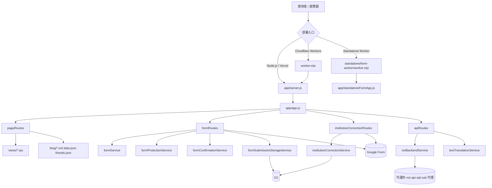

# N·C·T Legacy

<div align="center">
  <p><strong>NO CONVERSION THERAPY</strong></p>
  <p>舊版 <code>Express + EJS</code> 主站與表單流程倉庫，用於記錄、整理與公開展示「扭轉治療」相關機構與經歷資訊。</p>
  <p>
    <a href="./README.md">简体中文</a> ·
    <a href="./README.zh-TW.md"><strong>繁體中文</strong></a> ·
    <a href="./README.en.md">English</a>
  </p>
  <p>
    
    
    
    
    
  </p>
</div>

> 多語言 README 已盡量保持同步；如有差異，請以當前倉庫中的實際程式碼、腳本與配置為準。

## 目錄

- [專案簡介](#專案簡介)
- [目前定位](#目前定位)
- [核心能力](#核心能力)
- [技術棧](#技術棧)
- [技術架構圖](#技術架構圖)
- [倉庫結構](#倉庫結構)
- [快速開始](#快速開始)
- [常用命令](#常用命令)
- [Playwright 頁面冒煙截圖巡檢](#playwright-頁面冒煙截圖巡檢)
- [關鍵配置](#關鍵配置)
- [保護敏感配置](#保護敏感配置)
- [表單隱私說明](#表單隱私說明)
- [Cloudflare Workers 部署](#cloudflare-workers-部署)
- [路由總覽](#路由總覽)
- [執行期 API 現狀](#執行期-api-現狀)
- [相關檔案](#相關檔案)
- [貢獻](#貢獻)
- [授權](#授權)

## 專案簡介

`NCT_old` 是從同級 `No-Torsion` 拆出的 legacy 倉庫，保留了舊版 `Express + EJS` 主站、原有表單提交流程、Cloudflare Workers 入口，以及獨立表單 Worker。

它目前仍用於這些場景：

- 維護舊版首頁、地圖、部落格、隱私頁與記錄詳情頁
- 延續原有的 `/form`、`/map/correction`、`/correction` 提交流程
- 依配置將提交寫入 Google Form、D1，或同時寫入兩者
- 在保留本地 legacy 殼層的同時，把表單、修正與翻譯流程代理到 `nct-api-sql-sub`
- 單獨部署只承載問卷入口的 `standalone/form-worker`

## 目前定位

目前工作區中的幾個專案職責已拆分如下：

| 目錄 | 目前職責 |
| --- | --- |
| `NCT_old` | 舊版 `Express + EJS + Workers` 主站與表單流程 |
| `No-Torsion` | 新的靜態 `Vite + React` 前端殼層 |
| `nct-api-sql` | 主資料服務、公開 JSON、管理與同步能力 |
| `nct-api-sql-sub` | 獨立表單頁、No-Torsion 相容後端 API、翻譯與上報 |

如果你仍需要舊版 SSR 頁面或 legacy 提交流程，請繼續維護本倉庫；如果你在維護新前端殼層，請改到同級 `No-Torsion`。

## 核心能力

| 模組 | 說明 |
| --- | --- |
| 舊版主站 | `Express 5 + EJS` 渲染首頁、地圖、部落格、隱私頁、詳情頁等 |
| 匿名表單 | `/form` 支援預覽、確認、防刷 token、限流與 Google Form / D1 投遞 |
| 機構補充 / 修正 | `/map/correction` 與 `/correction` 保留獨立提交流程 |
| 獨立表單入口 | `standalone/form-worker` 可將問卷直接掛到 `/` |
| Workers 相容 | `worker.mjs` 復用同一套 Express 業務邏輯，並額外保護 `cn.json` |
| 後端代理模式 | runtime token、表單確認、修正提交與翻譯可代理到 `nct-api-sql-sub` |
| 多語言介面 | 透過 i18n 支援簡中、繁中、英文 |
| 內容站點 | Markdown 部落格文章與 `data.json`、`friends.json` 仍是內容來源的一部分 |

## 技術棧

| 類別 | 選型 |
| --- | --- |
| 服務端 | Node.js 20+, Express 5 |
| 模板引擎 | EJS |
| 前端 | legacy `public/js` 加上 `views/*.ejs` |
| 執行環境 | Node.js / Cloudflare Workers / Vercel 相容 Node 入口 |
| 資料落點 | Google Form / Cloudflare D1 |
| 限流 | 記憶體限流，可選 Redis 共享儲存 |
| 翻譯 | Google Cloud Translation API，可選代理到 `nct-api-sql-sub` |
| 配置安全 | 使用 `scripts/secure-config.js` 生成密文配置 |

## 技術架構圖



補充說明：

- `worker.mjs` 只做入口層補丁，核心業務邏輯仍在 Express 層。
- `standalone/form-worker` 會復用根目錄原始碼，但只打包獨立問卷需要的頁面與資源。
- 舊的地圖聚合 API 已退役，主應用與獨立表單現在都直接讀取 `public/content/*.json`。

## 倉庫結構

```text
.
├── app/
│   ├── middleware/              # i18n、維護模式與 Workers 靜態檔適配
│   ├── routes/                  # 頁面、表單、修正與 API 路由
│   ├── services/                # 表單、地圖、翻譯、代理、模板快取等
│   ├── app.js                   # 主站 Express 裝配
│   ├── server.js                # Node 啟動入口
│   ├── standaloneFormApp.js     # 獨立表單 Express 裝配
│   └── standaloneFormServer.js  # 獨立表單 Node 啟動入口
├── config/                      # 執行期配置、表單規則、安全與 i18n
├── public/                      # 靜態資源、GeoJSON、content 快照、腳本與樣式
├── views/                       # EJS 模板
├── blog/                        # Markdown 部落格文章
├── migrations/                  # D1 遷移
├── scripts/                     # secure-config 等工具
├── standalone/form-worker/      # 獨立問卷 Worker 入口包
├── tests/                       # Node 與 Playwright 測試
├── data.json                    # 文章索引與其他站點資料
├── friends.json                 # 關於頁友鏈 / 致謝資料
├── server.js                    # Vercel 相容入口
├── vercel.json                  # Vercel 配置
└── worker.mjs                   # 主站 Cloudflare Workers 入口
```

## 快速開始

### 1. 安裝依賴

```bash
git clone https://github.com/medicagooo/NCT_old.git
cd NCT_old
npm install
```

### 2. 以 Node 模式執行舊站

```bash
cp .env.example .env
npm start
```

預設行為：

- `npm start` 與 `npm run dev` 都會強制使用 `FRONTEND_VARIANT=legacy`
- 預設本地位址為 `http://127.0.0.1:3000`
- 本地開發時，除非你明確需要真實寫入，否則建議保持 `FORM_DRY_RUN="true"`

### 3. 以 Workers 模式執行舊站

```bash
cp .dev.vars.example .dev.vars
npm run dev:workers
```

### 4. 可選：驗證相容中的 React 殼層

倉庫仍保留 `public/react-app/` 產物與 `react_app.ejs`，供遷移期驗證使用；但根 `npm` 腳本仍以 legacy 前端為主。

如果你確實需要手動驗證 React 殼層，可執行：

```bash
FRONTEND_VARIANT=react node app/server.js
```

說明：

- 這不是目前 README 推薦的日常維護入口
- 倉庫目前沒有提供重建這套 React 產物的根級腳本

## 常用命令

| 命令 | 說明 |
| --- | --- |
| `npm start` | 以 Node 模式啟動舊站，並強制 `FRONTEND_VARIANT=legacy` |
| `npm run dev` | 與 `npm start` 相同 |
| `npm run dev:workers` | 本地執行主站 Workers 入口 |
| `npm run deploy:workers` | 部署主站到 Cloudflare Workers |
| `npm test` | 執行主要測試集 |
| `npm run test:standalone` | 只執行獨立表單相關測試 |
| `npm run test:smoke` | 執行 Playwright 冒煙截圖巡檢 |
| `npm run dev:workers:standalone-form` | 本地執行獨立問卷 Worker |
| `npm run deploy:workers:standalone-form` | 部署獨立問卷 Worker |
| `npm run secure-config -- generate-secret` | 生成高強度 `FORM_PROTECTION_SECRET` |
| `npm run secure-config -- bootstrap-env --env-file ".env"` | 將 env 檔中的明文 `FORM_ID` / `GOOGLE_SCRIPT_URL` 替換為密文 |

## Playwright 頁面冒煙截圖巡檢

這套巡檢會啟動本地應用並對關鍵路由截圖，同時檢查：

- 頁面層級的 `console.error`
- 未捕獲例外
- 同源請求失敗
- 表單預覽 / 確認 / 成功流程是否仍可運作

首次執行前先安裝瀏覽器：

```bash
npx playwright install chromium
```

接著執行：

```bash
npm run test:smoke
```

輸出位置：

- `test-results/playwright-smoke/`
- `manifest.json` 會記錄每個路由的截圖路徑與 HTTP 狀態

## 關鍵配置

完整變數說明請查看 [`.env.example`](./.env.example) 與 [`.dev.vars.example`](./.dev.vars.example)。這裡只列出最常調整的項目。

| 變數 | 用途 |
| --- | --- |
| `SITE_URL` | 用於 `robots.txt`、`sitemap.xml` 與 canonical link 的正式網址 |
| `FRONTEND_VARIANT` | `legacy` 或 `react`；但根 `npm` 腳本仍強制使用 `legacy` |
| `FORM_DRY_RUN` | `true` 時只做預覽，不會真正送出 |
| `FORM_SUBMIT_TARGET` | `/form` 投遞目標：`google`、`d1` 或 `both` |
| `CORRECTION_SUBMIT_TARGET` | `/map/correction` 與 `/correction` 的投遞目標：`google`、`d1` 或 `both` |
| `FORM_PROTECTION_SECRET` | 表單保護 token 與密文解密的核心 secret |
| `FORM_ID` / `FORM_ID_ENCRYPTED` | 匿名表單使用的 Google Form ID，二選一 |
| `CORRECTION_FORM_ID` / `CORRECTION_GOOGLE_FORM_URL` | 機構修正使用的 Google Form 配置 |
| `GOOGLE_SCRIPT_URL` / `GOOGLE_SCRIPT_URL_ENCRYPTED` | 私有 Apps Script 資料源，二選一 |
| `PUBLIC_MAP_DATA_URL` | 公開地圖 JSON 位址；預設會規整為 `/content/map-data.json` |
| `GOOGLE_CLOUD_TRANSLATION_API_KEY` | 啟用本地翻譯能力時需要 |
| `NCT_BACKEND_SERVICE_URL` | 設定後，runtime token、表單確認、修正與翻譯流程會代理到 `nct-api-sql-sub` |
| `NCT_BACKEND_SERVICE_TOKEN` | 代理後端使用的 Bearer Token |
| `RATE_LIMIT_REDIS_URL` | 多實例部署時的共享限流儲存 |
| `D1_BINDING_NAME` | 僅在 D1 綁定名不是 `NCT_DB` / `DB` 時需要 |
| `MAP_DATA_NODE_TRANSPORT_OVERRIDES` | 僅在 Node 執行期啟用代理 / IPv4 傳輸覆寫 |

配置原則：

- `FORM_ID` 與 `FORM_ID_ENCRYPTED` 只能選一個。
- `GOOGLE_SCRIPT_URL` 與 `GOOGLE_SCRIPT_URL_ENCRYPTED` 只能選一個。
- 如果 `FORM_SUBMIT_TARGET` 包含 `google`，應用必須能解析出 `FORM_ID`。
- 如果 `CORRECTION_SUBMIT_TARGET` 包含 `google`，你需要設定 `CORRECTION_FORM_ID` 或 `CORRECTION_GOOGLE_FORM_URL`。
- 如果任一提交目標包含 `d1`，請確認 Workers 或目標平台已真正綁定 D1。
- 如果配置了 `NCT_BACKEND_SERVICE_URL`，部分執行期流程會轉發到 `nct-api-sql-sub`，不再使用本地 legacy 實作。

## 保護敏感配置

如果你不想把 `FORM_ID` 與 `GOOGLE_SCRIPT_URL` 直接以明文存放在 env 檔，可以用內建工具轉成密文配置。

直接就地轉換既有 env 檔：

```bash
npm run secure-config -- bootstrap-env --env-file ".env"
```

本地 Workers 開發可改用：

```bash
npm run secure-config -- bootstrap-env --env-file ".dev.vars"
```

也可以分步操作：

```bash
npm run secure-config -- generate-secret
```

```bash
npm run secure-config -- encrypt --purpose form-id --secret "你的_FORM_PROTECTION_SECRET" --value "你的_GOOGLE_FORM_ID"
npm run secure-config -- encrypt --purpose google-script-url --secret "你的_FORM_PROTECTION_SECRET" --value "你的_GOOGLE_SCRIPT_URL"
```

需要注意的邊界：

- 如果使用 `FORM_ID_ENCRYPTED` 或 `GOOGLE_SCRIPT_URL_ENCRYPTED`，仍必須明確設定 `FORM_PROTECTION_SECRET`。
- 這能降低明文外洩風險，但不能取代真正的後端信任邊界設計。

## 表單隱私說明

目前表單流程應維持這條邊界：

> 出生年份、性別等基本個人資訊應被嚴格保密；機構曝光細節、經歷摘要等公開欄位可能出現在站點上。請不要在可能公開的欄位中填寫身分證字號、私人電話、家庭住址等高度敏感個資。

如果你之後調整公開欄位範圍，請同步更新：

- 表單頁提示文案
- `/privacy`
- 本 README

## Cloudflare Workers 部署

僅建議使用 Cloudflare Dashboard 的 Workers Builds 網頁部署。`NCT_old` 有兩個可選 Worker：舊版主站 `nct-old`，以及獨立問卷入口 `nct-old-standalone-form-worker`。

部署命令會執行 `npm run cf:ensure`，自動建立所需 D1 資料庫、把真實 `database_id` 寫入目前建置環境中的 Wrangler 設定，並執行遠端 D1 migrations；不需要手動建立 D1，也不要提交帳號專屬的 `database_id`。

### 舊版主站 Worker

| Cloudflare 頁面欄位 | 填寫值 |
| --- | --- |
| Project name | `nct-old` |
| Production branch | 你的生產分支，例如 `main` |
| Path / Root directory | 在本倉庫部署填 `NCT_old`；如果本專案單獨成庫填 `/` |
| Build command | `npm test` |
| Deploy command | `npm run deploy:workers` |
| Non-production branch deploy command | `npm run deploy:workers:preview` |

請在 `Settings` -> `Variables and Secrets` 配置執行期變數與密鑰，並在 `Settings` -> `Domains & Routes` 綁定自訂網域。

### 獨立問卷 Worker

| Cloudflare 頁面欄位 | 填寫值 |
| --- | --- |
| Project name | `nct-old-standalone-form-worker` |
| Production branch | 你的生產分支，例如 `main` |
| Path / Root directory | 在本倉庫部署填 `NCT_old`；如果本專案單獨成庫填 `/` |
| Build command | `npm run test:standalone` |
| Deploy command | `npm run deploy:workers:standalone-form` |
| Non-production branch deploy command | `npm run deploy:workers:standalone-form:preview` |

請將它建立為獨立於舊版主站的 Worker。在 `Settings` -> `Variables and Secrets` 配置獨立問卷變數後，再綁定自訂網域。

### Node / Vercel 相容入口

倉庫仍保留：

- [`server.js`](./server.js)
- [`vercel.json`](./vercel.json)

這讓你可以將應用作為 Node 相容服務執行，或接到 Vercel 的 Node function 模式。

## 路由總覽

### 頁面路由

| 路徑 | 說明 |
| --- | --- |
| `/` | 舊版首頁 |
| `/form` | 主匿名表單頁 |
| `/form/standalone` | 主應用中的獨立問卷頁 |
| `/map/correction` / `/correction` | 機構補充 / 修正頁 |
| `/map` | 地圖總覽頁 |
| `/map/record/:recordSlug` | 單筆記錄詳情頁 |
| `/aboutus` | 關於頁 |
| `/privacy` | 隱私說明頁 |
| `/blog` | 部落格列表 |
| `/port/:id` | 部落格文章詳情 |
| `/debug` | 調試頁，僅 `DEBUG_MOD=true` 時可用 |
| `/robots.txt` | 自動生成的 robots |
| `/sitemap.xml` | 自動生成的 sitemap |

### 提交流程路由

| 路徑 | 說明 |
| --- | --- |
| `POST /submit` | 主表單入口；依配置渲染預覽或確認頁 |
| `POST /submit/confirm` | 主表單最終投遞；寫入 Google Form、D1，或代理到 `nct-api-sql-sub` |
| `POST /map/correction/submit` | 機構修正提交入口 |
| `POST /correction/submit` | 與上列相同，保留作為相容別名 |

### 獨立問卷 Worker 路由

| 路徑 | 說明 |
| --- | --- |
| `/` | 獨立問卷首頁 |
| `/form/standalone` | `/` 的相容別名 |
| `/submit` | 獨立問卷提交入口 |
| `/submit/confirm` | 獨立問卷確認提交入口 |
| `/debug` | 獨立問卷調試頁 |
| `/healthz` | 健康檢查 |

## 執行期 API 現狀

### 仍在使用的 API

| 路徑 | 說明 |
| --- | --- |
| `GET /api/frontend-runtime?scope=form|correction` | 下發表單保護 token；若配置了 `NCT_BACKEND_SERVICE_URL`，會代理到 `nct-api-sql-sub` |
| `POST /api/translate-text` | 翻譯少量詳情文字；可在本地處理，也可代理到 `nct-api-sql-sub` |
| `GET /cn.json` | 中國 GeoJSON；在 Workers 下有額外完整性保護 |

### 已退役的 API

以下端點在主應用與獨立問卷中都會回傳 `410 Gone`：

| 路徑 | 現狀 | 替代方式 |
| --- | --- | --- |
| `GET /api/map-data` | 已退役 | 直接讀取 `public/content/map-data.json`，或使用你配置的 `PUBLIC_MAP_DATA_URL` |
| `GET /api/area-options` | 已退役 | 直接讀取 `public/content/area-selector.json` |

也就是說，目前的地圖頁與獨立表單已不再依賴服務端聚合 API，而是直接消費靜態或公開 JSON。

## 相關檔案

- [`.env.example`](./.env.example)：Node 模式環境變數模板
- [`.dev.vars.example`](./.dev.vars.example)：Workers 本地開發環境模板
- [`wrangler.jsonc`](./wrangler.jsonc)：主站 Workers 配置
- [`standalone/form-worker/wrangler.jsonc`](./standalone/form-worker/wrangler.jsonc)：獨立問卷 Worker 配置
- [`scripts/secure-config.js`](./scripts/secure-config.js)：密文配置工具
- [`worker.mjs`](./worker.mjs)：主站 Workers 入口
- [`app/app.js`](./app/app.js)：主站 Express 裝配
- [`app/standaloneFormApp.js`](./app/standaloneFormApp.js)：獨立問卷 Express 裝配
- [`migrations/`](./migrations)：D1 結構遷移

## 貢獻

提交變更前，至少建議執行：

```bash
npm test
```

如果你的改動涉及模板、頁面或表單流程，也建議補跑：

```bash
npm run test:smoke
```

## 授權

專案授權資訊請參見 [LICENSE](./LICENSE)。
